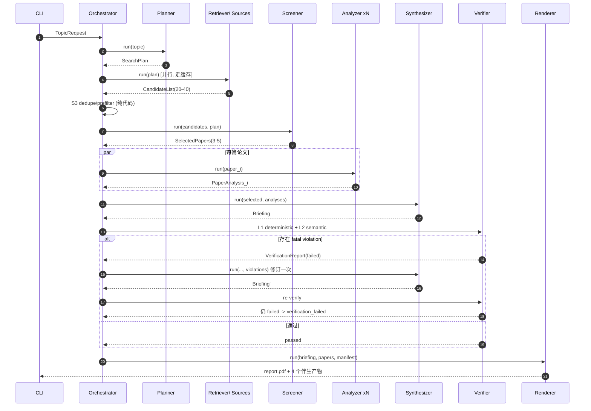

# docs/architecture.md — Literature Briefing 多 Agent 架构设计

> 本文档是 `AGENTS.md` §2（架构级决策）与 §3（多 Agent 设计）的**展开与实现级细化**。
> 冲突时以 `AGENTS.md` 为准；本文档提出但 `AGENTS.md` 未覆盖的细节，确认后应回写 `AGENTS.md`。
> 范围：设计（做什么、怎么连、契约是什么），不含进度。进度见 `docs/SPEC.md`。

---

## 0. 设计原则

这些原则贯穿全文，遇到取舍时按下列优先级决策：

1. **确定性优先**：凡是能用确定性代码算出来的，绝不交给 LLM。引用编号、去重、排序、页数、字段校验、缓存键、预算计数全部是纯代码。
2. **契约先行**：Agent 之间只交换 `src/briefing/schemas.py` 中的 pydantic 模型；任何跨 Agent 的裸 `dict` 视为设计缺陷。
3. **失败显式**：宁可失败并保留中间产物，也不静默降级产出「看起来完整」的报告。
4. **可审计**：一次运行的模型、prompt 版本、检索式、缓存命中、token 用量必须能事后重建。
5. **可测试**：每个 Agent 都是 `async def run(x: XIn) -> XOut` 的纯函数式单元，外部 IO 通过注入的 client 提供，默认离线可测。
6. **LLM 无状态**：所有跨 Agent 记忆只存在于显式数据契约中，不依赖对话历史。

---

## 1. 系统总览

### 1.1 流水线视图

```
 topic, --lang, --out, --no-cache, --resume
        │
        ▼
 ┌──────────────────┐  1 次 LLM
 │ S1 Planner       │──────────────▶ SearchPlan
 └────────┬─────────┘
          ▼
 ┌──────────────────┐  无 LLM；按 query×source 并行；走缓存
 │ S2 Retriever     │──────────────▶ CandidateList (20–40)
 └────────┬─────────┘
          ▼
 ┌──────────────────┐  纯确定性
 │ S3 Normalizer    │  DOI → arXiv ID → 归一化标题 去重、预过滤
 └────────┬─────────┘──────────────▶ DedupedCandidates
          ▼
 ┌──────────────────┐  ≤3 次 LLM
 │ S4 Screener      │──────────────▶ SelectedPapers (3–5)
 └────────┬─────────┘   n<3 ⇒ fatal(insufficient_papers)
          ▼
 ┌────────────────────────────┐  n 次 LLM，并行，Semaphore(4)
 │ S5 Analyzer × n            │──────────────▶ [PaperAnalysis]
 └────────┬───────────────────┘   任一失败 ⇒ fatal(analysis_failed)
          ▼
 ┌──────────────────┐  1 次 LLM
 │ S6 Synthesizer   │──────────────▶ Briefing（含 citation_keys，不含编号）
 └────────┬─────────┘
          ▼
 ┌──────────────────┐  确定性检查 + 1 次 LLM 语义检查
 │ S7 Verifier      │──fatal──▶ 回 S6 修订 1 次 ──仍 fatal ⇒ verification_failed
 └────────┬─────────┘
          ▼
 ┌──────────────────┐  纯确定性：编号分配 → HTML → PDF
 │ S8 Renderer      │──────────────▶ report.pdf, briefing.md, briefing.json,
 └──────────────────┘                papers.json, manifest.json
```

### 1.2 阶段与产物一览

| 阶段 | 执行者 | LLM | 并行度 | 落盘检查点 | 失败语义 |
| --- | --- | --- | --- | --- | --- |
| S1 Plan | `Planner` | 是（1） | — | `_stages/01_search_plan.json` | fatal |
| S2 Retrieve | `Retriever` + `sources/*` | 否 | query×source ≤4 | `_stages/02_candidates.json` | 单源可降级，全源失败 fatal |
| S3 Normalize | `Normalizer` | 否 | — | `_stages/03_deduped.json` | fatal |
| S4 Screen | `Screener` | 是（≤3） | — | `_stages/04_selected.json` | `insufficient_papers` fatal |
| S5 Analyze | `Analyzer` × n | 是（n） | Semaphore(4) | `_stages/05_analyses.json` | 任一 fatal |
| S6 Synthesize | `Synthesizer` | 是（1） | — | `_stages/06_briefing.json` | fatal |
| S7 Verify | `Verifier`（+ 1 次修订） | 是（≤1） | — | `_stages/07_verification.json` | `verification_failed` fatal |
| S8 Render | `Renderer` | 否 | — | 最终产物 | 渲染器降级；两者皆失败 fatal |

> `_stages/` 与 `manifest.json` 在**任何**结束路径下都必须落盘，包括失败与 `budget_exceeded`。

---

## 2. 编排器（Orchestrator）

### 2.1 职责

`orchestrator.py` 是唯一的流程控制点，包含且仅包含：

1. 构造 `RunContext`（配置、`LLMClient`、`CacheStore`、`BudgetGuard`、`UsageRecorder`、`run_id`、输出目录）。
2. 按固定顺序驱动 S1→S8，写阶段检查点。
3. 捕获异常 → 归类 → 写 `manifest.json` → 以既定退出码返回。
4. **不含业务逻辑**：不写 prompt、不做排序规则、不拼引用。

### 2.2 运行状态机

```
PENDING → PLANNED → RETRIEVED → NORMALIZED → SCREENED → ANALYZED
        → SYNTHESIZED → VERIFIED → RENDERED → OK
                          ↑            │
                          └── REVISING ┘ (最多 1 次)

任意阶段 ──▶ FAILED(run_error) | FAILED(insufficient_papers)
          | FAILED(analysis_failed) | FAILED(verification_failed)
          | FAILED(budget_exceeded) | FAILED(render_failed)
```

`manifest.status` 的取值集合固定为：`ok` / `run_error` / `insufficient_papers` / `analysis_failed` / `verification_failed` / `budget_exceeded` / `render_failed`。

### 2.3 检查点与 `--resume`

- 每个阶段结束写 `<out>/_stages/<NN>_<name>.json`。
- `--resume` 时，若检查点存在且其 `input_fingerprint`（= 上游产物哈希 + prompt 版本 + 模型 id 的 sha256）与当前一致，则跳过该阶段。
- 指纹不一致 ⇒ 忽略检查点重跑该阶段及后续阶段，并在 `manifest.resume` 中记录跳过了哪些阶段。

---

## 3. 数据契约（`src/briefing/schemas.py`）

所有模型 `model_config = ConfigDict(extra="forbid")`，字段名即契约；改字段名 = 破坏性变更，需在同一次改动中同步本文件、`src/briefing/schemas.py` 与 `AGENTS.md`。

### 3.1 输入与检索

```python
class TopicRequest(BaseModel):
    topic: str                                   # 3..300 chars，trim 后非空
    lang: Literal["zh", "en"] | None = None      # None ⇒ 按 topic 自动判定
    out_dir: Path
    min_papers: int = 3
    max_papers: int = 5
    time_window: tuple[int | None, int | None] | None = None
    no_cache: bool = False
    resume: bool = False
    run_id: str                                  # "<UTC ts>-<topic slug>"

class Query(BaseModel):
    source: Literal["arxiv", "openalex", "crossref", "semantic_scholar"]
    q: str
    rationale: str
    weight: float = 1.0

class SearchPlan(BaseModel):
    normalized_topic: str
    queries: list[Query]                         # 2..6
    keywords: list[str]                          # 3..12
    inclusion_criteria: list[str]                # 1..8
    exclusion_criteria: list[str]                # 0..8
    time_window: tuple[int | None, int | None]

class Paper(BaseModel):
    paper_id: str            # "doi:10.xxxx/yyy" | "arxiv:2401.01234" | "sha1:<title hash>"
    title: str
    authors: list[str]                           # ≥1
    year: int | None
    venue: str | None
    origin: str                                  # 命中的检索源
    url: str                                     # 必须来自 API 响应，不得由 LLM 生成
    doi: str | None
    arxiv_id: str | None
    abstract: str
    citation_count: int | None = None
    open_access: bool | None = None
    retrieved_at: datetime

class CandidateList(BaseModel):
    papers: list[Paper]
    queries_used: list[str]
    per_source_counts: dict[str, int]
    cache: "CacheStats"                          # hits / misses / bypassed
    dropped: dict[str, int]                      # 例如 {"no_abstract": 7}

class CacheStats(BaseModel):                     # 被 CandidateList 引用，见 §8 manifest
    hits: int = 0
    misses: int = 0
    bypassed: bool = False

class DedupedCandidates(BaseModel):              # S3 Normalizer 的输出
    papers: list[Paper]
    duplicates_removed: int = 0
    dropped: dict[str, int]                      # 预过滤台账，见 §4 S3：
                                                 # 含硬移除与软标记（no_abstract /
                                                 # short_abstract），被标记的论文仍保留
    queries_used: list[str]                      # 透传检索式，供后续失败信息复现
```

### 3.2 选文与分析

```python
class ScreenedPaper(BaseModel):
    paper: Paper
    rank: int                                    # 1-based，连续
    relevance_score: float                       # 0..1
    rationale: str
    matched_inclusion: list[str]                 # 必须引用 SearchPlan 中的条目原文
    matched_exclusion: list[str]

class SelectedPapers(BaseModel):
    items: list[ScreenedPaper]                   # 3..5，validator 强制
    selection_notes: str | None

class ScreenerChoice(BaseModel):                 # LLM 面向：只给 tag，不给元数据
    tag: str                                     # "C1".."Cn"，由 S4 代码映射回 Paper
    rank: int                                    # ≥1
    relevance_score: float                       # 0..1
    rationale: str
    matched_inclusion: list[str]
    matched_exclusion: list[str]

class ScreenerResponse(BaseModel):
    selected: list[ScreenerChoice]               # ≥1
    selection_notes: str | None

class Evidence(BaseModel):
    field: Literal["abstract", "metadata", "fulltext_snippet"]
    locator: str                                 # 例如 "abstract[0:180]"
    quote: str                                   # 报告展示 ≤300 chars：超出由 S5 确定性裁剪为
                                                 #   原文前缀 + 省略号，仍可溯源；schema 只设 2000
                                                 #   的兜底上限，因为越界是格式溢出而非事实错误

class PaperAnalysis(BaseModel):
    paper_id: str
    problem: str
    method: str
    data_and_experiments: str
    key_findings: list[str]                      # 1..6
    limitations: list[str]                       # 1..5
    relevance: str                               # 与本次 topic 的关系：为什么值得读
    reusable_ideas: list[str]                    # 0..5
    evidence: list[Evidence]                     # ≥1，供 Verifier 溯源
    confidence: float                            # 0..1
```

### 3.3 简报与验证

```python
class Claim(BaseModel):
    text: str
    citation_keys: list[str]                     # 形如 ["P2","P4"]；事实性断言 ≥1

class PaperCard(BaseModel):
    citation_key: str                            # "P1".."Pn"
    analysis: PaperAnalysis

class ComparisonRow(BaseModel):
    citation_key: str
    task: str
    method_family: str
    data: str
    metrics: str
    main_result: str

class Briefing(BaseModel):
    run_id: str
    topic: str
    lang: Literal["zh", "en"]
    executive_summary: str                       # ≤120 字（按 lang 计）
    background_md: str
    method_md: str                               # 检索方法与纳入/排除标准
    paper_cards: list[PaperCard]                 # 顺序 = SelectedPapers.items 顺序
    comparison: list[ComparisonRow]              # 行数 == 论文数
    gaps_and_open_questions: list[Claim]
    further_reading: list[Claim]

class Violation(BaseModel):
    kind: Literal["unknown_citation_key", "unknown_candidate", "unsupported_claim",
                  "duplicate_reference", "missing_reference", "length_limit",
                  "language_mismatch"]
    severity: Literal["fatal", "warn"]
    location: str                                # 例如 "gaps_and_open_questions[2]"
    detail: str

class VerificationReport(BaseModel):
    passed: bool
    deterministic: list[Violation]
    semantic: list[Violation]
    revision_requested: bool
```

**引用键机制（关键设计）**：LLM 只能使用 `P1..Pn` 形式的**引用键**，且键集合由代码在 prompt 中显式给出。真正的人类可读编号 `[1]..[n]` 由 `render/references.py` 在 S8 按 `SelectedPapers.items` 顺序确定性分配。这样「同一条引用指向两篇论文」在结构上不可能发生，`[1]` 与参考文献的对应关系也不依赖模型输出。

---

## 4. Agent 规格

所有 Agent 遵循同一签名与同一条 IO 边界：

```python
class Agent(Protocol[In, Out]):
    name: str
    prompt_version: str | None
    async def run(self, payload: In, ctx: RunContext) -> Out: ...
```

### S1 `Planner`

| 项 | 规格 |
| --- | --- |
| 输入 | `TopicRequest` |
| 输出 | `SearchPlan` |
| Prompt | `prompts/planner_v1.md` |
| 模型 | `DEEPSEEK_MODEL`（temperature 0，JSON 输出） |
| 硬约束 | 中/英文 topic 都要产出**英文**检索式；非英文 topic 需同时保留原语关键词；禁止编造 venue 或结论 |
| 校验 | `queries` 2..6；`keywords` 3..12；未知数据源名 ⇒ schema 失败并重试 |
| 失败 | schema 重试 ≤2 后 fatal |

### S2 `Retriever`

| 项 | 规格 |
| --- | --- |
| 输入 | `SearchPlan` |
| 输出 | `CandidateList` |
| LLM | 无 |
| 实现 | `sources/arxiv.py`（主）、`openalex.py` / `crossref.py` / `semantic_scholar.py`（可选） |
| 并发 | `asyncio.gather` + 全局 `Semaphore(4)`，逐源内再 `Semaphore(2)` |
| 降级 | 可选源缺 key/失败 ⇒ 记 `per_source_counts[src]=0` 并继续；arXiv 失败且无其他源可用 ⇒ fatal |
| 约束 | 目标召回 20–40 篇（去重前）；每源单次请求 ≤ 100 条；`User-Agent: briefing/0.1 (+repo url)` |
| 上限 | arXiv `max_results` 按 query 分配；总请求数 ≤ 20 |

### S3 `Normalizer`

| 项 | 规格 |
| --- | --- |
| 输入 | `CandidateList` |
| 输出 | `DedupedCandidates`（`list[Paper]` + 去重统计） |
| LLM | 无 |
| 去重键优先级 | `doi` → `arxiv_id` → 归一化标题（lower、去标点、压缩空白、去副标题后比较） |
| 预过滤 | `abstract` 缺失 ⇒ 降权保留；`abstract < 300` chars ⇒ 打 `short_abstract` 标记 |
| 确定性 | 输出顺序 = `(来源优先级, 发表年份 desc, paper_id)`，保证跨运行稳定 |

### S4 `Screener`

| 项 | 规格 |
| --- | --- |
| 输入 | `DedupedCandidates` + `SearchPlan`（纳入/排除标准） |
| 输出 | `SelectedPapers` |
| Prompt | `prompts/screener_v1.md`（或 `_v2`，需与 manifest 记录一致） |
| 模型 | 可用 `DEEPSEEK_MODEL_REASONING`；temperature 0 |
| 调用上限 | ≤3 次（含 schema 重试） |
| 硬约束 | 只能从候选中挑选，**禁止输出候选集之外的论文**。模型只看到 tag（`C1`..`Cn`）并只返回 tag，由代码映射回 `Paper`；未知 tag 丢弃并记 `Violation(kind="unknown_candidate")`，重复 tag 记 `duplicate_reference` |
| 失败 | 有效选文 < `min_papers` ⇒ `InsufficientPapersError`（附查询式、候选数、放宽建议）；> `max_papers` ⇒ 截断到 top n 但记 `warn` |

### S5 `Analyzer`（fan-out，每篇一个实例）

| 项 | 规格 |
| --- | --- |
| 输入 | 单个 `ScreenedPaper` + 该篇的 `Paper`（摘要 + 元数据） |
| 额外输入 | **topic 与报告语言**（拼进 prompt）：没有 topic 就写不出 `relevance` |
| 输出 | `PaperAnalysis` |
| Prompt | `prompts/analyzer_v2.md` |
| 模型 | `DEEPSEEK_MODEL`，temperature 0.2 |
| 并发 | 全部论文并行，受全局 `Semaphore(4)` 限制 |
| 硬约束 | `paper_id` 必须等于输入的 `paper_id`（防串页）；`evidence.quote` 必须能在输入摘要/元数据中原文匹配（代码校验，不匹配 ⇒ 该条 evidence 剔除，≥1 条不匹配 ⇒ schema 失败重试） |
| 失败 | 重试 ≤2；仍失败 ⇒ `AnalysisFailedError`，**整次运行失败**（不静默丢弃，见 §7 不变量 I5） |
| 成本 | 每次调用只喂摘要 + 元数据（≤ 8k chars），禁止喂全文 |

### S6 `Synthesizer`

| 项 | 规格 |
| --- | --- |
| 输入 | `SelectedPapers` + `[PaperAnalysis]`（按 rank 对齐） |
| 输出 | `Briefing` |
| Prompt | `prompts/synthesizer_v2.md` |
| 模型 | `DEEPSEEK_MODEL_REASONING`（可配置），temperature 0.3 |
| 硬约束 | 只允许使用给定引用键；`comparison` 行数 == 论文数；`executive_summary` ≤120 字；跨论文结论必须带引用键 |
| 失败 | schema 重试 ≤2；仍失败 ⇒ fatal |

### S7 `Verifier`（两层）

| 层 | 执行 | 检查项 |
| --- | --- | --- |
| L1 确定性（纯代码，无 LLM） | `verify/deterministic.py` | ① 所有 `citation_keys` ⊆ `{P1..Pn}`；② 每个 key 都能映射到 `papers.json` 中的 `paper_id`；③ `comparison`/`paper_cards` 覆盖全部论文且无重复；④ `executive_summary` 长度；⑤ 语言一致性（`lang`）；⑥ `evidence.quote` 溯源仍成立 |
| L2 语义（LLM，可选开关） | `verify/semantic.py` + `prompts/verifier_v1.md` | 判断「带引用的断言是否被对应论文的摘要/分析支持」；temperature 0；只允许输出 `Violation` 列表，不得改写正文 |

处置流程：L1 有 `fatal` 或 L2 有 `fatal` ⇒ `revision_requested = True`，把 `Violation` 列表回灌 S6 修订**一次**；第二次仍 fatal ⇒ `verification_failed`。`warn` 一律不阻塞，写入 manifest 与报告附录。

> L2 可通过 `BRIEFING_VERIFY_SEMANTIC=0` 关闭（离线测试默认关闭），但 L1 永远开启。

### S8 `Renderer`

| 项 | 规格 |
| --- | --- |
| 输入 | `Briefing` + `SelectedPapers` + `RunManifest`（草稿） |
| 输出 | `report.pdf` / `briefing.md` / `briefing.json` / `papers.json` / `manifest.json` |
| LLM | 无 |
| 步骤 | ① 分配引用编号 `[1]..[n]`；② 由 `papers.json` 生成参考文献（格式：`作者. 标题. 来源, 年份. DOI/URL`）；③ Jinja2 渲染 HTML（`report/templates/report.html.jinja` + `styles.css`）；④ WeasyPrint 出 PDF，失败则降级 headless Chromium 并置 `renderer.fallback = true` |
| 硬要求 | CJK 字体内嵌（Noto Sans CJK / Source Han）；文本可选中；固定 10 章结构（见 `AGENTS.md` §8）；页码与目录 |
| 校验 | 用 `pypdf` 断言页数 > 0 且能提取到非空文本；断言正文引用编号集合 == 参考文献集合 |

---

## 5. 时序（含修订回路）



---

## 6. 并发、重试与预算

### 6.1 并发模型

```python
sem = asyncio.Semaphore(settings.max_concurrency)          # 默认 4，作用于所有 LLM 调用
http_sem = asyncio.Semaphore(settings.max_http_concurrency) # 默认 4，作用于检索

async with sem:
    return await llm.complete(prompt, schema=Out, ...)
```

- 只有 S2 与 S5 是并发阶段；其余阶段串行，便于检查点与预算核算。
- 禁止在 Agent 内自行 `create_task` 逃逸到 semaphore 之外。
- 取消传播：任一并发任务抛 fatal ⇒ `asyncio.gather(..., return_exceptions=True)` 收敛后统一抛错，已完成的检查点仍落盘。

### 6.2 重试策略（`tenacity`）

| 错误类别 | 示例 | 策略 |
| --- | --- | --- |
| 瞬时网络/限流 | 429、500/502/503/504、读超时、连接错误 | 指数退避 + 抖动，≤5 次；`Retry-After` 优先 |
| 输出不合契约 | JSON 解析失败、pydantic `ValidationError` | 携带**校验错误原文**重试 ≤2 次（append 到 prompt） |
| 请求本身非法 | 400/401/403/404（除 429） | 不重试，直接 fatal，错误信息可读 |
| 业务规则不满足 | 选文不足 3、evidence 无法溯源 | 不重试（重试无意义），走对应 fatal 分支 |

### 6.3 预算核算（`BudgetGuard`）

- 每次 LLM 调用前：`if calls + 1 > MAX_LLM_CALLS or tokens_est > MAX_TOKENS_BUDGET: raise BudgetExceeded`。
- 每次调用后：累计 `prompt_tokens` / `completion_tokens`，写入 `manifest.llm_usage`。
- 触发上限 ⇒ status=`budget_exceeded`，保留已完成的 `_stages/*.json`，不写半成品 PDF。
- 预算法则：单次运行的 LLM **调用预算**（正常路径）：

| 阶段 | 计划调用 |
| --- | --- |
| S1 | 1 |
| S4 | 1（重试最多 +2） |
| S5 | n（3–5） |
| S6 | 1（修订最多 +1） |
| S7 L2 | 1（关闭时为 0） |
| **合计** | **7–9**（上限 40 留有充足重试余量） |

---

## 7. 不变量（Invariants）

以下条件在**任何**成功运行中都必须成立，逐条对应测试用例：

| # | 不变量 | 保障机制 |
| --- | --- | --- |
| I1 | `3 ≤ len(papers.json) ≤ 5` | S4 schema validator + `InsufficientPapersError` |
| I2 | 每篇论文 `paper_id` 唯一，且 `url` 来自 API 响应 | S3 去重 + S4 未知 id 丢弃 |
| I3 | 报告中每个引用编号都能映射到唯一一篇 `papers.json` 条目 | S8 由代码分配编号 |
| I4 | 参考文献列表 ⊆ 真实检索结果，无 LLM 生成的条目 | S8 只从 `papers.json` 渲染 |
| I5 | 「3–5 篇」中的每一篇都有完整 `PaperAnalysis` | S5 失败即整次失败 |
| I6 | 跨 Agent 数据只经 pydantic 模型 | 代码评审 + `mypy` + 类型签名 |
| I7 | 任意结束路径都写出 `manifest.json` | Orchestrator 的 `finally` 分支 |
| I8 | 报告可重建：模型 id + prompt 版本 + 参数 + 检索式齐全 | manifest schema 强制 |
| I9 | 未授权的全文内容不落盘、不进 prompt | S5 输入只允许摘要/元数据 |

---

## 8. 可观测性：`manifest.json` 契约

```json
{
  "run_id": "20260917T0900Z-diffusion-weather",
  "topic": "diffusion models for weather forecasting",
  "lang": "en",
  "status": "ok",
  "started_at": "2026-09-17T09:00:12Z",
  "finished_at": "2026-09-17T09:03:41Z",
  "duration_s": 209.4,
  "model": {
    "id": "<from DEEPSEEK_MODEL>",
    "reasoning_id": "<from DEEPSEEK_MODEL_REASONING | null>",
    "base_url_host": "api.deepseek.com",
    "params": { "temperature": { "plan": 0.0, "analyze": 0.2, "synthesize": 0.3 },
                "top_p": 1.0, "max_tokens": 4096 }
  },
  "prompt_versions": { "planner": "planner_v1", "screener": "screener_v1",
                       "analyzer": "analyzer_v2", "synthesizer": "synthesizer_v2",
                       "verifier": "verifier_v1" },
  "retrieval": {
    "queries": [ { "source": "arxiv", "q": "all:\"diffusion model\" AND all:\"weather forecasting\"", "weight": 1.0 } ],
    "candidates_found": 34, "after_dedup": 27, "selected": 5,
    "per_source_counts": { "arxiv": 34, "openalex": 0 },
    "cache": { "hits": 2, "misses": 3, "bypassed": false, "ttl_days": 30 },
    "dropped": { "no_abstract": 4, "short_abstract": 3 }
  },
  "llm_usage": { "calls": 9, "prompt_tokens": 41230, "completion_tokens": 8830,
                 "est_cost_usd": null, "per_stage": { "S1": 1, "S4": 1, "S5": 5, "S6": 1, "S7": 1 } },
  "budget": { "max_calls": 40, "max_tokens": 400000, "exceeded": false, "reason": null },
  "verification": { "passed": true, "deterministic_violations": 0,
                    "semantic_violations": 0, "revisions": 0, "semantic_enabled": true },
  "renderer": { "name": "weasyprint", "version": "x.y.z", "fallback": false, "cjk_font_embedded": true },
  "stage_timings_s": { "S1": 4.1, "S2": 18.7, "S3": 0.2, "S4": 12.9, "S5": 61.3, "S6": 47.5, "S7": 39.0, "S8": 25.7 },
  "resume": { "enabled": false, "skipped_stages": [] },
  "artifacts": { "report_pdf": "report.pdf", "briefing_md": "briefing.md",
                 "briefing_json": "briefing.json", "papers_json": "papers.json" },
  "error": null
}
```

> `est_cost_usd` 只在价格表配置存在时填写，否则为 `null` —— 不猜价格。
> 日志为结构化 JSON（每阶段一条 + 每次 LLM 调用一条），字段含 `run_id` / `stage` / `agent` / `duration_ms` / `tokens`，**不得**包含 API key 或完整 prompt（只记 prompt 版本与哈希）。

---

## 9. Prompt 管理

| Agent | 文件 | 输入变量 | 输出契约 |
| --- | --- | --- | --- |
| Planner | `prompts/planner_v1.md` | `{topic}`, `{lang}`, `{available_sources}`, `{time_window}` | `SearchPlan` JSON |
| Screener | `prompts/screener_v1.md` | `{plan}`（含纳入/排除标准）, `{candidates}`（仅 id/标题/年份/来源/摘要节选） | `SelectedPapers` JSON |
| Analyzer | `prompts/analyzer_v2.md` | `{topic}`, `{lang}`, `{paper_id}`, `{title}`, `{authors}`, `{year}`, `{venue}`, `{abstract}` | `PaperAnalysis` JSON（含 `relevance`） |
| Synthesizer | `prompts/synthesizer_v2.md` | `{run_id}`, `{topic}`, `{lang}`, `{summary_char_limit}`, `{catalogue}`, `{violations}` | `BriefingDraft` JSON（卡片分析由代码挂载） |
| Verifier | `prompts/verifier_v1.md` | `{catalogue}`, `{claims}` | `SemanticVerification`（仅违规列表） |

规则：

- 文件名内嵌版本号，**任何文字改动都必须升版**（`_v1` → `_v2`），旧版本保留至少一个提交周期以便对比。
- prompt 内不得出现具体模型名；模型由配置注入。
- prompt 中必须显式写明「只允许使用如下引用键：P1..Pn」以及「不得输出参考文献条目」。
- 每个 prompt 文件头部写：`agent` / `version` / `inputs` / `output_json_schema` / `failure_modes`。

---

## 10. 目录与模块映射

| 关注点 | 路径 | 备注 |
| --- | --- | --- |
| CLI 入口 | `src/briefing/cli.py` | 参数解析、退出码（2=参数错，1=运行失败） |
| 编排 | `src/briefing/orchestrator.py` | 状态机 + 检查点 |
| 契约 | `src/briefing/schemas.py` | 本文 §3 |
| 配置 | `src/briefing/config.py` | env 前缀 `BRIEFING_` |
| Agents | `src/briefing/agents/{planner,retriever,screener,normalizer,analyzer,synthesizer}.py` | 每个文件一个 Agent |
| 验证 | `src/briefing/verify/{deterministic,semantic,report}.py` | L1/L2 分离便于单测；`report.py` 组装报告与修订策略，且不导入任何 LLM 代码 |
| LLM | `src/briefing/llm/deepseek_client.py`, `llm/base.py`(`LLMClient` Protocol), `llm/budget.py` | 业务代码只依赖 Protocol |
| 数据源 | `src/briefing/sources/{arxiv,openalex,crossref,semantic_scholar}.py`, `sources/base.py`(`Source` Protocol), `sources/cache.py` | 新增源只需实现 Protocol |
| 渲染 | `src/briefing/report/{render_pdf.py,references.py,templates/report.html.jinja,styles.css}` | 编号分配在 `references.py` |
| Prompt | `src/briefing/prompts/*_v<N>.md` | §9 |
| 测试 | `tests/unit/`, `tests/integration/`, `tests/fixtures/` | §11 |

---

## 11. 测试策略到组件的映射

| 组件 | 测试类型 | 关键用例 |
| --- | --- | --- |
| `Normalizer` | unit（离线） | DOI 冲突、仅 arXiv ID 相同、标题归一化（大小写/标点/副标题）、顺序稳定性 |
| `Screener` | unit + fixtures | 正常 3–5 选文；候选只有 2 篇 ⇒ `insufficient_papers`；LLM 返回候选集外 id ⇒ 丢弃并告警；返回 7 篇 ⇒ 截断 |
| `Analyzer` | unit（stub LLM） | 正常；`paper_id` 不匹配 ⇒ 失败；evidence 无法原文匹配 ⇒ 重试后失败；失败 ⇒ 整次运行失败 |
| `Verifier` L1 | unit（无 LLM） | 未知引用键、comparison 行数不符、summary 超长、语言不符、引用编号与参考文献一一对应 |
| `Verifier` L2 | unit（stub） | 无支撑断言 ⇒ 触发一次修订；第二次仍失败 ⇒ `verification_failed` |
| `CacheStore` | unit | 键稳定性、命中/未命中计数、TTL 过期、`--no-cache` 绕过 |
| `LLMClient` | unit（respx） | 429/5xx 退避、超时、schema 错误重试携带错误原文、4xx 不重试、预算超限抛出 |
| `Renderer` | integration（fixtures） | PDF 存在、页数 > 0、`pypdf` 可提取文本、CJK 不乱码、字体内嵌标志 |
| `Orchestrator` | integration（全离线 fixtures） | 端到端 `ok`；每个 fatal 分支的 status 与 `manifest.json` 字段；`--resume` 跳过已完成阶段 |
| 不变量 I1–I9 | integration | 逐条断言 |

真实联网 + 真实 LLM 的用例统一加 `@pytest.mark.live`，仅 `RUN_LIVE_TESTS=1` 时运行。

---

## 12. 扩展点

| 想做的事 | 正确做法 | 禁止做法 |
| --- | --- | --- |
| 新增论文数据源 | 实现 `Source` Protocol，注册到 `sources/__init__`，在 `SearchPlan` 的 source 枚举中登记 | 在 Retriever 里写 `if source == "xxx"` 分支堆积 |
| 换模型 / 换供应商 | 改 `DEEPSEEK_MODEL` / `DEEPSEEK_BASE_URL` 配置，或实现新的 `LLMClient` | 在 Agent 中硬编码模型名或 SDK 调用 |
| 新增报告章节 | 改 `Briefing` schema + prompt + Jinja 模板 + 章节顺序测试 | 在模板里塞业务逻辑 |
| 报告语言 | 走 `TopicRequest.lang` | 在 prompt 里写死语言 |
| 提高并发 | 调 `MAX_CONCURRENCY` | 在 Agent 内部绕过 semaphore |

---

## 13. 与 `AGENTS.md` 的一致性自检

| `AGENTS.md` 条款 | 本文档对应 |
| --- | --- |
| §2.1 确定性 pipeline + fan-out，不用通用框架 | §1.1, §2, §6.1 |
| §2.2 只依赖 `LLMClient` 协议 | §4, §10 |
| §2.3 只传 pydantic 模型 | §3, I6 |
| §2.4 缓存命中进 manifest | §8 `retrieval.cache` |
| §2.5 引文只能来自检索元数据 | §3.3 引用键机制, §4 S8, I4 |
| §3 Analyzer 并行 / 失败即失败 | §4 S5, I5 |
| §3 Verifier 修订一次 | §4 S7, §5 时序图 |
| §3 prompt 带版本号并写入 manifest | §9, §8 `prompt_versions` |
| §6 模型来自配置、temperature 分档、重试策略 | §4 各 Agent、§6.2 |
| §6/§11 预算与调用上限 | §6.3 |
| §7 检索规则（20–40→3–5、去重、缓存 TTL） | §4 S2/S3/S4 |
| §8 报告 10 章结构与引用格式 | §4 S8 |
| §10 测试必须覆盖项 | §11 |
| §1.1 产物清单与验收条件 | §7 I1–I9, §8 |

---

## 14. 待确认项（与 `AGENTS.md` §14 联动）

- [ ] `max_concurrency` 默认 4 是否匹配 DeepSeek 账号的实际并发/限流配额（需一次真实压测确认）。
- [ ] S7 L2 语义验证的开销占比；若过高，考虑只对「跨论文结论」与 `gaps_and_open_questions` 抽样执行。
- [ ] `--resume` 的 `input_fingerprint` 是否要把检索结果的 `retrieved_at` 排除在外（否则缓存复用时指纹会抖动）。
- [ ] WeasyPrint 可用性 → 决定默认 renderer；若降级为 Chromium，需确认字体内嵌验证方式。
- [ ] 报告页数上限与单篇卡片字数上限，用于反推 `max_tokens` 与 token 预算。
